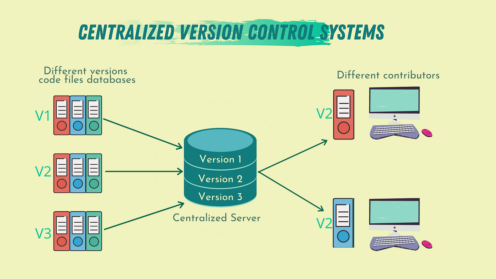

<p align="right">
     <a href="./translation/README.es.md" target="_blank">
       
   </a>
    <a href="./README.md" target="_blank">
       
   </a>
</p>

<div align="center">

# Centralized\_Version\_Control\_System\_V1\_Nodejs

</div>

Sistema de control de versiones web centralizado implementado con NodeJS, Typescript, Express, dotenv, nodemon, morgan, etc.

<br>

## Índice 📜

<details>
 <summary> Ver </summary>

 <br>

### Sección 1) Descripción, configuración y tecnologías.

*   [1.0) Descripción del Proyecto.](#10-descripción-)
*   [1.1) Ejecución del Proyecto.](#11-ejecución-del-proyecto-)
*   [1.2) Configuración del proyecto desde cero](#12-configuración-del-proyecto-desde-cero-)
*   [1.3) Comandos de utilidad.](#13-comandos-de-utilidad)
*   [1.4) Tecnologías.](#14-tecnologías-)

### Sección 2) Endpoints y Ejemplos

*   [2.0) EndPoints y recursos.](#20-endpoints-y-recursos-)
*   [2.1) Ejemplos.](#21-ejemplos-)

### Sección 3) Prueba de funcionalidad y Referencias

*   [3.0) Prueba de funcionalidad.](#30-prueba-de-funcionalidad-)
*   [3.1) Referencias.](#31-referencias-)

<br>

</details>

<br>

## Sección 1) Descripción, configuración y tecnologías.

### 1.0) Descripción [🔝](#índice-)

<details>
  <summary>Ver</summary>

 <br>

### 1.0.0) Descripción General

### 1.0.1) Descripción Arquitectura y Funcionamiento

<br>

</details>

### 1.1) Ejecución del Proyecto [🔝](#índice-)

<details>
  <summary>Ver</summary>
<br>

<br>

</details>

<br>

### 1.2) Configuración del proyecto desde cero [🔝](#índice-)

<details>
  <summary>Ver</summary>

<br>

*   Instalamos la última versión LTS de [Nodejs(v18)](https://nodejs.org/en/download)

*   Creamos un entorno de trabajo a través de algún ide, luego de crear una carpeta nos posicionamos sobre la misma

```git
cd 'projectName'
```

*   Creamos un proyecto npm de nodejs

```git
npm init -y
```

*   Creamos un archivo .gitignore y agregamos los files necesarios (por el momento node\_modules)

```git
mkdir .gitignore
```

*   Creamos un direct source (src) para agregar toda la lógica de nuestra app

```git
touch src
```

*   Instalamos el plugin para [express (framework web)](https://www.npmjs.com/package/express)

```git
npm i express
```

*   Instalamos el plugin para [dotenv (variables de entorno)](https://www.npmjs.com/package/dotenv)

```git
npm i dotenv
npm i dotenv-expand
```

*   Instalamos el plugin para cors

```git
npm i cors
```

*   Instalamos el plugin para convertir objetos json desde middleware

```git
npm i body-parser
```

*   Instalamos el plugin para [morgan-middleware (errores, formatos, etc)](https://expressjs.com/en/resources/middleware/morgan.html)

```git
npm i morgan
```

*   Instalamos el plugin para [nodemon (autoreload server)](https://www.npmjs.com/package/nodemon) de forma global

```git
npm i -g nodemon
```

*   Instalamos el plugin para [nodemon (autoreload server)](https://www.npmjs.com/package/nodemon) para desarrollo

```git
npm i nodemon --save-dev
```

*   Ejecutamos la app desde terminal para entorno local.

```git
npm run dev
```

*   Ejecutamos la app desde terminal para entorno productivo.

```git
npm start
```

*   Si se presenta algún mensaje indicando qué el puerto 8080 ya está en uso, podemos terminar todos los procesos dependientes y volver a ejecutar la app

```git
npx kill-port 8080
npm run dev o npm start
```

<br>

</details>

### 1.3) Comandos de utilidad [🔝](#índice-)

<details>
  <summary>Ver</summary>

 <br>

<br>

</details>

### 1.4) Tecnologías [🔝](#índice-)

<details>
  <summary>Ver</summary>

 <br>

| **Tecnologías** | **Versión** | **Finalidad** |\
| ------------- | ------------- | ------------- |
| [NodeJS](https://nodejs.org/en/) | 14.18.1  | Librería JS |
| [Typescript](https://www.typescriptlang.org/) | 3.8.3  | Lenguaje con alto tipado basado en JS |
| [VSC](https://code.visualstudio.com/docs) | 1.72.2  | IDE |
| [Postman](https://www.postman.com/downloads/) | 10.11  | Cliente Http |
| [CMD](https://learn.microsoft.com/en-us/windows-server/administration/windows-commands/cmd) | 10 | Símbolo del Sistema para linea de comandos |
| [Git](https://git-scm.com/downloads) | 2.29.1  | Control de Versiones |

</br>

| **Extensión** |\
| -------------  |
| Prettier - Code formatter |
| Typescript Toolbox - generate setters, getters, constrc, etc |
| Otras |

<br>

</details>

<br>

## Sección 2) Endpoints y Ejemplos.

### 2.0) Endpoints y recursos [🔝](#índice-)

<details>
  <summary>Ver</summary>

<br>

</details>

### 2.1) Ejemplos [🔝](#índice-)

<details>
  <summary>Ver</summary>
<br>

<br>

</details>

<br>

## Sección 3) Prueba de funcionalidad y Referencias.

### 3.0) Prueba de funcionalidad [🔝](#índice-)

<details>
  <summary>Ver</summary>

<br>

<br>

</details>

### 3.1) Referencias [🔝](#índice-)

<details>
  <summary>Ver</summary>

 <br>

#### Documentos

*   [Acerca del control de versiones](https://unity.com/es/solutions/what-is-version-control)
*   [Ejemplos de softwares de control de versiones](https://www.drauta.com/5-softwares-de-control-de-versiones)

#### Proyectos

*   [Desarrollo de una aplicación Web para
    control de versiones de software](https://e-archivo.uc3m.es/bitstream/handle/10016/11936/PFC-David%20Otero%20Gutierrez.pdf?sequence=1\&isAllowed=y)

#### Versionadores Open source

*   https://devhints.io/semver
*   https://github.com/npm/node-semver
*   https://keepcoding.io/blog/que-es-el-versionado-semantico-semver/

#### File System

*   [Lectura de nombres de archivos a traves de directorios](https://stackoverflow.com/questions/2727167/how-do-you-get-a-list-of-the-names-of-all-files-present-in-a-directory-in-node-j)
*   [Ejemplo Logica para File paths](https://stackoverflow.com/questions/2727167/how-do-you-get-a-list-of-the-names-of-all-files-present-in-a-directory-in-node-j)
*   [Métodos filehandle](https://nodejs.org/api/fs.html)

<br>

</details>
